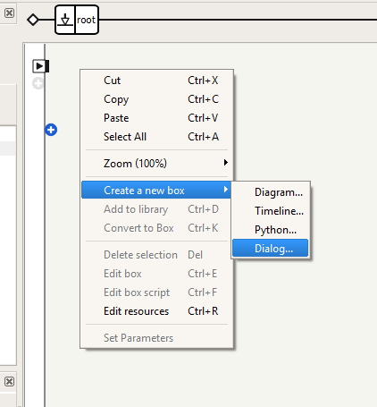
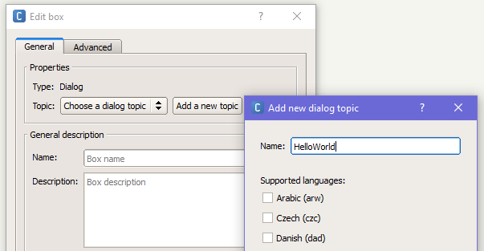
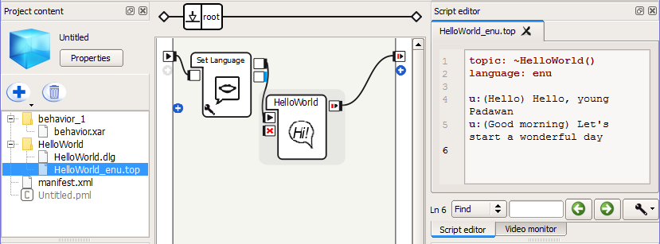
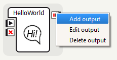
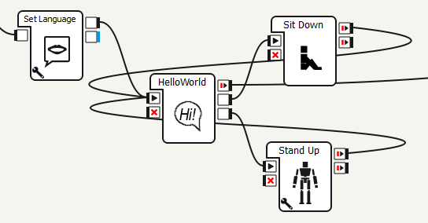
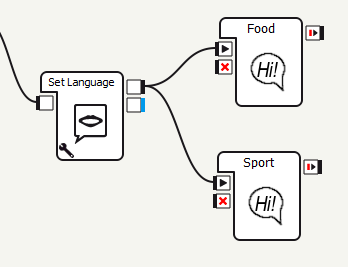

## Цель работы

Цель данной работы --- научиться программировать Nao на скриптовом языке
_QiChat_ в _Choregraphe_ таким образом, чтобы работ мог выполнять действия в
зависимости от условий, в том числе воспроизводять анимацию.

## Теория

Язык _QiChat_ позволяет писать _Dialog Topic_ --- скрипты для Nao, с помощью
которых можно задавать его поведение в виде диалога между пользователем и
роботом. Мы будем создавать и запускать эти скрипты в программе _Choregraphe_.

### Общие сведения

#### Тема

_Тема_ --- это скрипт, файл с расширением `.top`, расположенный в текущем
проекте и включающий в себя правила. Её _заголовок_ должен содержать как минимум
_название_ диалога и его _язык_. Например:

``` linenums="1"
topic: ~introduction ()
language: enu
u:(hello) hello human
```

_Заголовок_ --- это первые две строки, `topic: ~introduction ()` и `language:
*enu`, где первая задаёт тему диалога, а вторая указывает, что разговор будет
вестись на английском языке (русский язык обозначается `rur`, весь список
поддерживаемых языков можно посмотреть на сайте ‼ссылка). Последняя строчка --
скрипт из одного _правила_, согласно которому в ответ на сказанное человеком
`hello` робот должен ответить `hello human`.

#### Правило

_Правила_ соотносят вводные данные от человека (то, что он говорит) с выходными
данными робота (то, что робот отвечает или делает). Правила начинаются с новой
строки и индикатора `u:`. Далее в круглых скобках указываются слова человека, а
вне их --- ответ робота.

При помощи разделителей, специальных символов, а также функций и свойств можно
создавать мощные правила, которые в одной строке будут учитывать множество
разных случаев. О них будет сказано далее.

В примере выше был представлен пример простого правила, которое конкретной фразе
человека (`hello`) сопоставляет конкретный ответ робота (`hello human`). Помимо
простых правил, существуют ещё два вида: _подправила_ и _инструкции_.

#### Подправило

_Подправила_ позволяют создавать несколько контекстов в рамках одной беседы, при
этом конкретные подправила активируются только в том случае, если активировано
соответствующее  (т.е. более высокого уровня) пользовательское правило или
инструкция.

``` linenums="1"
u:(input1) answer1
   u1:(input2) answer2
   u1:(input3) answer3
     u2:(input4) answer4
        u3:(input5) answer5
     u2:(input6) answer6

proposal: sentence
   u1:(input7) answer
   u1:(input8) answer
```

Здесь `u1:`, `u2:` и `u3:` --- пользовательские подправила. Отступы отражают
отношения между правилами и их подправилами.

##### Особенности

Во-первых, _пользовательские правила_ и _инструкции_ активны, когда неактивны
**подправила**.

* Если выполняется условие `(input1)` и активируется _правило_ `u:`, то
	управление переходит к его подправилам `u1:`, но при этом другие
	_пользовательские правила_ верхнего уровня `u:` остаются активны.
* Если выполняется одно из условий подправил `u1:` (`(input2)` или `(input2)`),
	то активируется соответствующее подправило. В данном примере или выводится
	`answer2`, или управление переходит к правилу `u2:`, а правила уровня `u1:`
	деактивируются.
* Если в любое время активируется другое _пользовательское правило_ `u:`, то
	остальные подправила деактивируются.

Если требуется находиться в рамках текущего правила, даже если уже было
задействовано соответствующее подправило (т.е. роботом был дан ответ),
используется  команда `^stayInScope`:

``` linenums="1"
u:(input) answer
   u1:(input1) answer1 ^stayInScope
   u1:(input2) answer2
```

То есть, даже ответив `answer1` на `input1`, робот не выйдет из контекта и
сможет отреагировать также и на `input2`.

#### Инструкции

_Инструкции_ --- это список фраз или действий, которые робот высказывает или
делает последовательно, реагируя на одно общее ключевое слово.

**Синтаксис:**

Последовательность действий инструкции описывается следующим образом в заголовке скрипта:

``` linenums="1"
proposal: step1
proposal: step2
proposal: step3
proposal: step4
```

В теле скрипта переход между пунктами активируется фразой человека, например,
`next`, и _функцией последовательности_:

``` linenums="1"
u:(next) ^nextProposal
```

#### Особенности

Для переключения может использоваться одна из следующих _функций
последовательности_, помимо приведённой в примере `^nextProposal`:

* `^previousProposal`
* `^sameProposal`
* `^goto`
* `^gotoRandom`
* `^gotoReactivate`
* `^topicTag`

При вызове функции `^sameProposal` робот повторяет последнее предложение в теме,
`^previousProposal` --- шедшее перед ним.

В других случаях, когда пункт инструкции высказан, робот уже не может его
повторить. Однако может быть использована функция `^gotoReactivate`:

``` linenums="1"
proposal: %tag Answer
u:(input) ^gotoReactivate(tag)
```

Она позволяет перейти к неактивному пункту инструкции, помеченному
соответствующим тегом, и запусть его снова.

Ключевое слово `%tag` может быть применимо не только к пунктам инструкции, но и
просто к правилам:

``` linenums="1"
proposal: %tag sentence
u:(input) %tag answer
```

Оно указывает на одно или неколько инструкций или правил и позволяет напрямую
перейти к нему (ним). Функция `^goto` может быть также использована, чтобы
обозначить эквивалентными несколько фраз, которые могут поступить от человека,
то есть, робот может давать на них один и тот же ответ.

``` linenums="1"
u: (input1) %tag answer
u: (input2) ^goto(tag)
u: (input3) smth ^goto(tag)
```

Функция `^gotoRandom` работает аналогичным образом, только в случае, если одним
тегом помечено несколько выражений, она случайным образом выбирает одно.

``` linenums="1"
u:(input) ^gotoRandom(tag)
proposal: %tag answer1
proposal: %tag answer2
```

Так же используется `^topicTag`, но для перехода к отмеченному тегом `%tag`
ответу из другой темы `topic`.

``` linenums="1"
^topicTag(topic,tag)
```

### Применение

#### Создание диалога

* Сперва нужно запустить _Choregraphe_ и подключить к ней робота, как было
	описано в предыдущей лабораторной, при помощи кнопки `[connect to]`
	.
* Затем в меню, появляющемуся по правому клику по пустому серому полю панели
	блок-схем, выберите `[Create new box] > [Dialog...]`.



* В появившемся окне кликните по кнопке `[Add a new topic]`, где в `Name`
	напишите название диалога без пробелов, например, `HelloWorld`. Также там
	можно выбрать язык, однако следует учитывать, что на роботе одновременно
	установлено только два языка, а не все, которые есть в списке. Затем нажмите
	на кнопки `[Add]` и `[OK]`.



* Соедините иконку созданного диалога со входом программы или предыдущими
	заданными действиями (например, `Set language` для переключения языка).
* На панели контента проекта (_Project content_) дважды кликните по файлу
	`HelloWorld_enu.top`, чтобы открыть его в редакторе скриптов (_Script
	editor_). Можно увидеть, что в скрипте уже заполнены первые две строки его
	названием и языком.
* Для примера напечатайте следующие правила:

``` linenums="1"
u:(Hello) Hello, young Padawan
u:(Good morning) Let's start a wonderful day
```

Интерфес программы должен выглядеть примерно как на рисунке ниже:



* Запустите программу кнопкой `[Play]` .

После этого звуком и анимацией лампочек в "глазах" робот предложит Вам сказать
что-либо.

* Скажите `Good morning` напротив него или введите те же слова в _Dialog panel_
	и затем нажмите `[enter]`. Робот ответит `Let's start a wonderful day`
* Скажите (или напишите) роботу `Hello`, он должен ответить `Hello, young
	Padawan`.

####  Синонимичные конструкции

* Чтобы сделать более комплексное правило, можно изменить скрипт следующим
	образом:

``` linenums="1"
u:([hi hello wassup]) hello young padawan
u:(["tell me" "give me"] your name) of course, my name is NAO
```

В квадратных скобках указываются взаимозаменяемые фразы или слова, на которые
робот реагирует одинаково. Если использовать такую конструкцию в *ответе
робота*, то он будет высказывать написанные фразы (слова) последовательно при
каждой активации правила.

#### Объединение скрипта и анимации

* Создайте новые правила:

``` linenums="1"
u:(["can you" please] sit down {now}) ok i sit down $sit=1
u:(["can you" please] stand up {now}) ok i stand up $standup=1
```

В фигурных скобках обозначено необязательное слово, которое можно произнести или нет.

* Добавьте два `[выхода]` 
	к блоку _Hello world_ (кликнуть правой кнопкой мыши по уже имеющемуся выходу
	блока и выбрать там `Add output`).



Выходам нужно задать отдельные названия (по умолчанию они назваются `output`)

* `sit`
* `standup`


[//]: # (‼ я не знаю зачем следующий пункт надо проверить что он точно нужен ‼)
[//]: # (* Добавьте 2 блока `[Flow Control] > [Time] > [Wait]` (вкладка **standard** в **Box libraries**) и соедините их с созданными выходами)

* Добавьте на поле и присоедините к соответствующим выходам блоки
	`[Motions] > [Sit Down]` и `[Motions] > [Stand Up]` (вкладка _standard_ в
	_Box libraries_). Выходы блоков анимации желательно присоединить ко входу
	блока со скриптом. Должно получиться следующее:

[//]: # (image::screenshots/lab2-animation1.PNG[animation,align="center"])
[//]: # (‼ ИЛИ ‼)



В результате запуска программы робот должен садиться и вставать в ответ на сказанное веловеком.

#### Переключение между несколькими темами

* Создайте два отдельных блока `Dialog topic` с названиями _Food_ и _Sport_ и
	следующим содержимым:

``` linenums="1"
topic: ~Food()
language: enu
u:(let's talk about food) OK, guess what I like
u:^private(do you like fish) yes and sea food too
u:^private(do you like meat) no, I don't
```

``` linenums="1"
topic: ~Sport()
language: enu
u:(let's talk about sport) OK, guess what sport I like
u:^private(do you like tennis) no, I can't play tennis
u:^private(do you like yoga) yes, would you like to do yoga with me?
```

* Подключите их к одному `[выходу]` 
	предыдущего блока или `[входу]`   _скрипта_.



После запуска робот будет вести разговор на одну тему, пока вы не попросите его
говорить о другой.

Для перехода из одной темы в другую и фокусировки на ней используются
пользовательские правила; в данном примере `"Let's talk about food"` и
`"Let's talk about sport"`. Когда тема находится в фокусе

* активируются все её _приватные правила_, (`^private`),
* в то время как деактивируются _приватные правила_ другой темы.

## Задания

Создайте два диалога (тексты можно взять, например, с сайтов для обучения
английскому языку --- [onlinenglish](http://onlinenglish.ru/dialog.html) или
[englishspeak](http://onlinenglish.ru/dialog.html)), обеспечить переключение
между ними. Также в любой из тем должна запускаться как минимум одна анимация и
быть применены теги, подправила или инструкции и конструкция с заменяемыми или
необязательными словами.